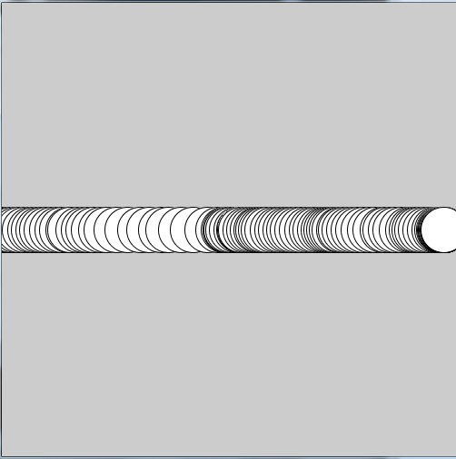

# Functions (and Methods), beyond void

In the previous course, you were introduced to some basic functions and methods in which the only return value was ``void``.

The following example of a function should look familiar:
```processing
//Example #1

void display() {
    ellipse(500, 500, 50, 50);
}
```

The only purpose of this function is display an ellipse at `500, 500`, with a size of `50`.

Even though these proved useful, there is more to functions than what was given to you previously.  Functions can be used to complete calculations, or to see if something is `true` or `false`.

The general setup for a function is as follows:

```processing
<returnType> functionName(<parameters>) {
    //function does work here
    return <returnType>
}
```

To give some more formal examples:

```processing
//Example #2

float addition(float first, float second) {
    float sum = first + second;
    return sum;
}
```

This function takes in two parameters `first` and `second` of type `float`, adds them together, and then returns the sum as an `float` to whoever called the function.

An example that could use this function in Processing would look like:

```processing
//Example #3

void setup() {
    size(500, 500);
}
    
void draw() {
    fill(255);
    
    float position = addition(mouseX, mouseY)/2;
    ellipse(position, height/2, 50, 50);
}

float addition(float first, float second) {
  float sum = first + second;
  return sum;
}
```
In example #3 above, the use of the addition function is add the values of `mouseX` and `mouseY`.  This example could have the output shown below.




###Functions vs Methods

The only difference between a function and a method in Processing/Java, is that a method is inside an object, and a function has no association to an object.

To learn more about objects, or to refresh your memory regarding objects, please see the [Objects](./objects.md) chapter.

###Exercises
1. Create a basic Processing sketch that uses a function to tell whether your mouse is on the left half of the screen, or the right half of the screen.  Have the function return a `boolean` value.