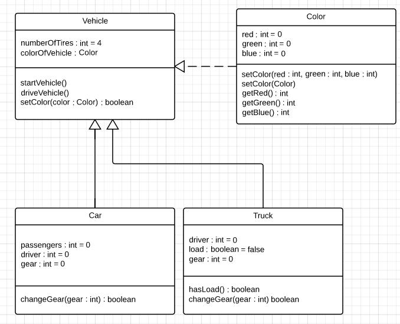

#UML

UML (Unified Modeling Language) is a general-purpose language to model and visualize designs for a system.  UML will be used in this class extensively before you start the coding process for the larger projects.

In this class, we will be learning the basics of UML class diagrams to plan out our programming projects.  For a more in-depth look into UML and the various other diagrams involved, you can check for other resources online.

##Purpose
In previous years, we focused on flowcharting which helped with the direction and flow of the project.  This year we will be looking at the UML class diagrams to help us plan our projects.  Class diagrams help to ensure encapsulation as well as give us a good overview of the work to complete before starting on our code.

This type of planning is useful in a collaborative environment.  Team members have their responsibilities and understanding of how each other class will be set up.

##Structure

###Single class
A class diagram is set up into 3 different sections.  The class name, the instance variables, and the methods that exist within that object.

| Course |
|------|
|teacher : String = "Ms. Tissism"   courseCode : String |
|handInWork (work : String)   receiveGrade (grade : int) |

The above is a basic example of a class diagram that could be used for a course offered at high school.

The first section contains the class name `Course`.  The next section contains the instance variables `teacher` and `courseCode` as well as their datatypes and their default starting values (if necessary).  The last section contains the various methods a `Course` can have: `handInWork` and `receiveGrade`.  It also contains each of the method's parameter lists.  There is one parameter for `handInWork` which is `work` of type `String`, and one parameter for `receiveGrade` which is `grade` of type `int`.

###Relationships
In a larger environment, there will be many class diagrams all inter-related in some fashion.  This is where a relationship diagram involving the various class diagrams comes in handy.

In the example below, there are two types of arrows showing the relationship between the classes.  The solid-lined arrow shows an "IS-A" [inheritance](./inheritance.md) relationship, whereas the dashed-lined arrow shows a "HAS-A" [inheritance](./inheritance.md) relationship.

